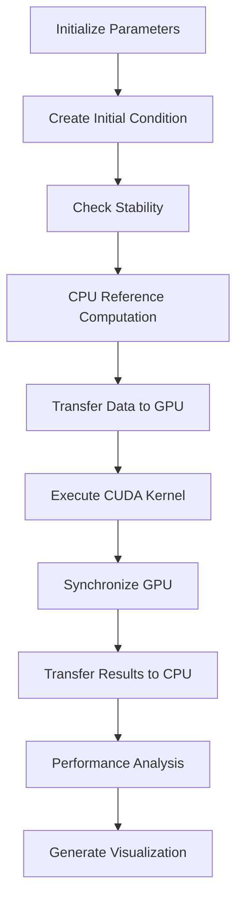

# 1D Heat Equation Solver with CUDA

This example demonstrates GPU-accelerated solution of the 1D heat equation using Numba's CUDA JIT compiler. It showcases advanced CUDA programming concepts including grid synchronization, double buffering, and numerical methods for partial differential equations.

## Mathematical Background

### The Heat Equation

The 1D heat equation is a fundamental partial differential equation (PDE) that describes heat diffusion:

```
∂u/∂t = α * ∂²u/∂x²
```

Where:
- `u(x,t)` = temperature at position x and time t
- `α` = thermal diffusivity coefficient
- `∂u/∂t` = rate of temperature change over time
- `∂²u/∂x²` = second spatial derivative (curvature)

### Finite Difference Method

We discretize the PDE using explicit finite differences:

**Spatial Discretization:**
```
∂²u/∂x² ≈ (u[i-1] - 2*u[i] + u[i+1]) / Δx²
```

**Temporal Discretization:**
```
∂u/∂t ≈ (u[i]^(n+1) - u[i]^n) / Δt
```

**Combined Finite Difference Scheme:**
```
u[i]^(n+1) = u[i]^n + k * (u[i-1]^n - 2*u[i]^n + u[i+1]^n)
```

Where `k = α * Δt / Δx²` is the dimensionless diffusion coefficient.

### Numerical Stability

For explicit finite difference schemes, numerical stability requires:
```
k = α * Δt / Δx² ≤ 0.5
```

This is known as the **CFL (Courant-Friedrichs-Lewy) condition**. Violating this condition leads to numerical instability and unbounded growth of errors.

## Technical Implementation

### CUDA Kernel Architecture

```python
@cuda.jit
def solve_heat_equation(buf_0, buf_1, timesteps, k):
    i = cuda.grid(1)

    if i >= len(buf_0):
        return

    grid = cuda.cg.this_grid()

    for step in range(timesteps):
        # Double buffering logic
        if (step % 2) == 0:
            data = buf_0
            next_data = buf_1
        else:
            data = buf_1
            next_data = buf_0

        # Finite difference computation
        curr_temp = data[i]

        if i == 0:
            # Left boundary condition
            next_temp = curr_temp + k * (data[i + 1] - (2 * curr_temp))
        elif i == len(data) - 1:
            # Right boundary condition
            next_temp = curr_temp + k * (data[i - 1] - (2 * curr_temp))
        else:
            # Interior points
            next_temp = curr_temp + k * (
                data[i - 1] - (2 * curr_temp) + data[i + 1]
            )

        next_data[i] = next_temp
        grid.sync()  # Critical synchronization
```

#### Key Technical Concepts:

1. **Thread-to-Data Mapping**: Each CUDA thread handles one spatial grid point
   - Thread ID `i` corresponds to spatial position `x[i]`
   - Enables parallel computation across all spatial points

2. **Double Buffering**: Alternates between two GPU memory buffers
   - Prevents race conditions during parallel updates
   - `buf_0` and `buf_1` alternate as source and destination
   - Essential for explicit time-stepping schemes

3. **Grid Synchronization**: `grid.sync()` ensures all threads complete current timestep
   - **Critical for correctness**: Prevents threads from reading partially updated data
   - More expensive than block-level synchronization but necessary for this algorithm
   - Requires cooperative groups (`cuda.cg`)

4. **Boundary Conditions**: Dirichlet boundary conditions (T = 0 at walls)
   - Left wall (i=0): Only considers right neighbor
   - Right wall (i=N-1): Only considers left neighbor
   - Interior points: Full 3-point stencil

### Memory Access Patterns

The implementation exhibits optimal memory access characteristics:

1. **Coalesced Access**: Consecutive threads access consecutive memory locations
2. **Spatial Locality**: Each thread accesses neighboring elements (i-1, i, i+1)
3. **Temporal Locality**: Same memory locations accessed across timesteps

### Performance Considerations

#### GPU Architecture Factors:

1. **Occupancy**: High occupancy due to simple computation per thread
2. **Memory Bandwidth**: Memory-bound algorithm (low arithmetic intensity)
3. **Synchronization Overhead**: Grid synchronization adds latency
4. **Register Usage**: Minimal register pressure per thread

#### Scalability Analysis:

- **Strong Scaling**: Performance vs. problem size for fixed total work
- **Weak Scaling**: Performance vs. problem size with proportional work increase
- **Memory Limitations**: GPU memory capacity limits maximum problem size

## Code Structure and Components

### Core Functions:

1. **`solve_heat_equation()`**: Main CUDA kernel
   - Implements explicit finite difference scheme
   - Handles boundary conditions and grid synchronization

2. **`solve_heat_equation_cpu()`**: CPU reference implementation
   - Used for validation and performance comparison
   - Identical algorithm but sequential execution

3. **`create_initial_condition()`**: Initial temperature distribution setup
   - Creates hot spot at specified location
   - Configurable temperature and position

4. **`check_stability()`**: Numerical stability analysis
   - Validates CFL condition
   - Warns about potential instability

### Execution Workflow:



## Boundary Conditions

The implementation uses **Dirichlet boundary conditions**:

- **Left Boundary (x=0)**: u(0,t) = 0 (fixed temperature)
- **Right Boundary (x=L)**: u(L,t) = 0 (fixed temperature)

This creates a "heat sink" effect where temperature at the boundaries is always zero, causing heat to flow outward and eventually dissipate.

### Alternative Boundary Conditions:

1. **Neumann**: ∂u/∂x = 0 (insulated boundaries)
2. **Robin**: α*u + β*∂u/∂x = γ (convective heat transfer)
3. **Periodic**: u(0,t) = u(L,t) (circular domain)

## Physical Interpretation

### Heat Diffusion Process:

1. **Initial State**: Hot spot at center (T = 10,000)
2. **Diffusion**: Heat spreads to neighboring points
3. **Boundary Effects**: Heat dissipates at fixed-temperature walls
4. **Equilibrium**: Eventually reaches steady state (T = 0 everywhere)

### Key Physical Parameters:

- **Thermal Diffusivity (α)**: Material property affecting diffusion rate
- **Grid Spacing (Δx)**: Spatial resolution
- **Time Step (Δt)**: Temporal resolution
- **Diffusion Coefficient (k)**: Numerical parameter combining α, Δt, Δx

## Performance Analysis

### Expected Performance Characteristics:

1. **Memory-Bound**: Limited by GPU memory bandwidth, not compute
2. **Synchronization Overhead**: Grid sync adds latency each timestep
3. **Scalability**: Linear scaling with problem size up to memory limits

### Optimization Opportunities:

1. **Shared Memory**: Cache neighboring values in shared memory
2. **Temporal Blocking**: Compute multiple timesteps per kernel launch
3. **Multi-GPU**: Distribute spatial domain across multiple GPUs
4. **Mixed Precision**: Use float16 for memory bandwidth improvement

## Requirements

### Hardware:
- CUDA-capable NVIDIA GPU (Compute Capability 6.0+)
- Sufficient GPU memory for problem size

### Software:
- Python 3.7+
- NumPy
- Numba with CUDA support
- Matplotlib (for visualization)
- CUDA Toolkit 10.0+

## Usage

```bash
python 1D_heat_equation.py
```

### Expected Output:
```
1D Heat Equation Solver
==================================================
Grid size: 1001
Time steps: 10000
Diffusion coefficient: 0.25

Stability Analysis:
  Diffusion coefficient k = 0.25
  Stability limit = 0.5
  Scheme is STABLE

Initial condition: Hot spot at position 500 with T = 10000.0

--- CPU Reference Computation ---
CPU time (101 points, 1000 steps): 0.0234 seconds

--- GPU Computation ---
GPU time (1001 points, 10000 steps): 0.1456 seconds
Estimated speedup: 16.08x

--- Results ---
Final maximum temperature: 0.00
Final minimum temperature: 0.00
Temperature at center: 0.00

--- Generating Visualization ---
Visualization saved as 'heat_equation_results.png'
```

## Visualization

The code generates comprehensive visualizations:

1. **Temperature Distribution**: Initial vs. final spatial profiles
2. **Temporal Evolution**: Temperature decay at center point over time
3. **Comparison Plots**: Theoretical vs. numerical solutions

### Interpretation:

- **Initial Profile**: Sharp peak at center
- **Final Profile**: Flat line (equilibrium state)
- **Evolution**: Exponential decay characteristic of diffusion processes

## Learning Objectives

This example teaches:

### CUDA Programming:
1. **Grid Synchronization**: Using cooperative groups for global sync
2. **Double Buffering**: Managing multiple GPU memory buffers
3. **Memory Management**: Efficient host-device transfers
4. **Performance Analysis**: CPU vs. GPU benchmarking

### Numerical Methods:
1. **Finite Differences**: Discretizing partial differential equations
2. **Stability Analysis**: Understanding CFL conditions
3. **Boundary Conditions**: Implementing different boundary types
4. **Validation**: Comparing numerical and analytical solutions

### Parallel Algorithm Design:
1. **Domain Decomposition**: Mapping spatial domain to threads
2. **Synchronization Patterns**: When and why to synchronize
3. **Memory Access Optimization**: Achieving coalesced access
4. **Scalability Considerations**: Strong vs. weak scaling

## Advanced Topics

### Extensions and Modifications:

1. **2D/3D Heat Equation**: Extend to higher dimensions
2. **Implicit Methods**: Implement backward Euler or Crank-Nicolson
3. **Adaptive Time Stepping**: Dynamic Δt based on local error
4. **Non-uniform Grids**: Variable spatial resolution
5. **Variable Coefficients**: Spatially varying thermal properties

### Research Applications:

- **Materials Science**: Thermal processing simulation
- **Geophysics**: Heat flow in Earth's crust
- **Engineering**: Thermal management in electronics
- **Biology**: Heat transfer in biological tissues

This implementation serves as a foundation for understanding both GPU programming and computational physics, providing a stepping stone to more complex PDE solvers and scientific computing applications.